# HireConnect: Advanced Job Portal Architecture & System Design Report

A comprehensive, microservice-based job search, application, and interview orchestration platform built with a modern **Angular Frontend**, **Spring Boot & Spring Cloud Backend Services**, **MySQL databases**, **RabbitMQ Message Broker**, and **Redis Caching**.

---

## Table of Contents
1. [Project Overview](#1-project-overview)
2. [System Architecture](#2-system-architecture)
3. [Microservices Explanation](#3-microservices-explanation)
4. [Database Design & Schema Analysis](#4-database-design--schema-analysis)
5. [Authentication & Security Implementation](#5-authentication--security-implementation)
6. [Event-Driven Integration with RabbitMQ](#6-event-driven-integration-with-rabbitmq)
7. [Frontend Architecture (Angular)](#7-frontend-architecture-angular)
8. [End-to-End User & Request Flows](#8-end-to-end-user--request-flows)
9. [Deployment Architecture](#9-deployment-architecture)
10. [Design Patterns & Architectural Best Practices](#10-design-patterns--architectural-best-practices)
11. [Performance Optimization & Scalability Strategy](#11-performance-optimization--scalability-strategy)
12. [Complete Technical Summary](#12-complete-technical-summary)

---

## 1. Project Overview

### 1.1 Platform Description
**HireConnect** is an enterprise-grade, highly scalable job portal and recruitment orchestration platform. Designed on a decentralized microservices architecture, it bridges the gap between candidates searching for career opportunities and recruiters managing hiring pipelines. The application separates operational domains (authentication, profile, job posting, application tracking, interview scheduling, notifications, billing, and system telemetry) into independent, fine-grained microservices.

### 1.2 Core Capabilities & Value Proposition
- **Dynamic Profile Portability**: Candidates build robust profiles showcasing skills, professional history, and educational backgrounds, with integrated resume storage.
- **Quota-Restricted Job Publishing**: Recruiters post job requisitions governed by active monetization plans and real-time usage quotas.
- **Asynchronous Pipeline Telemetry**: Real-time notifications keep candidates and recruiters aligned when job states update, applications are submitted, or interviews are scheduled.
- **System-Wide Analytics**: Interactive dashboards aggregate high-performance operational metrics and business intelligence diagrams across multiple transactional databases.

### 1.3 System Roles & Permissions Matrix
The platform enforces strict role separation at both the API Gateway and service levels:

```
+------------------+----------------------------------------------------------------------------------+
| Role             | Permissions & Scope                                                              |
+------------------+----------------------------------------------------------------------------------+
| CANDIDATE        | - Authenticate, build/update personal profiles, and upload resumes.              |
|                  | - Search, filter, and apply for open job postings.                               |
|                  | - Track job application statuses (Applied, Reviewing, Shortlisted, Hired).        |
|                  | - View interview invites, confirm availability, and receive alerts.              |
+------------------+----------------------------------------------------------------------------------+
| RECRUITER        | - Set up company profiles, logos, and contact information.                       |
|                  | - Purchase, renew, or upgrade subscription plans (Free, Professional, Enterprise).|
|                  | - Create, edit, and deactivate job listings (restricted by subscription quotas).  |
|                  | - Review, filter, and shortlist job applications.                                |
|                  | - Schedule, reschedule, or cancel candidate interviews.                          |
|                  | - Access recruiter dashboard analytics (views, conversion rates, hiring counts). |
+------------------+----------------------------------------------------------------------------------+
| ADMIN            | - Moderate users, profiles, and job postings across the entire platform.         |
|                  | - Access master administrative console with financial and user telemetry.        |
|                  | - Send bulk operational alerts and system-wide notifications.                    |
|                  | - Track revenue generation and active subscription plan distributions.          |
+------------------+----------------------------------------------------------------------------------+
```

---

## 2. System Architecture

### 2.1 Technical Architecture Overview
HireConnect uses a cloud-native architectural blueprint characterized by **Domain-Driven Design (DDD)**, service decentralization, database-per-service pattern, and event-driven choreography. 

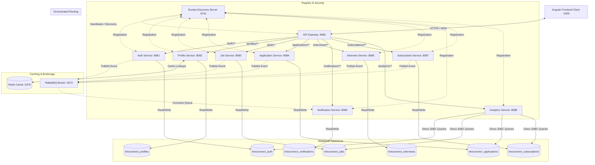

### 2.2 Core Infrastructure Components
1. **Frontend Flow (Angular Single Page Application)**: Renders user interfaces, maintains client-side states, and communicates via asynchronous HTTP calls using an Angular JWT Interceptor to automatically attach credentials to outgoing requests. Real-time notifications are ingested via a STOMP-over-WebSocket connection.
2. **API Gateway (Spring Cloud Gateway)**: Acts as the exclusive entry point for all API clients. Features reactive routing, CORS configuration, rate-limiting, and centralized JWT validation. Validated payloads are enriched with identity headers (`X-User-Email`, `X-User-Name`) and forwarded to the downstream services registered in the service directory.
3. **Eureka Discovery Server (Spring Cloud Netflix Eureka)**: Serves as a dynamic service catalog. Downstream microservices register their dynamic IP addresses and port bindings at startup, allowing the API Gateway and inter-service HTTP clients to locate them via service identifiers (e.g., `lb://job-service`) without hardcoded URLs.
4. **RabbitMQ Broker**: Decouples the primary application flows from notifications and background processing. Microservices publish event payloads (e.g., application creation, interview scheduling) to a central exchange, which routes them to durable queues. The Notification Service consumes these events asynchronously.
5. **Redis Cache**: Optimizes candidate and recruiter profile fetches in the Profile Service. Frequently accessed profiles are stored in memory to reduce SQL database load and drop read latency to sub-millisecond rates.
6. **Decentralized Databases (MySQL)**: Each microservice owns its schema (e.g., `hireconnect_jobs`, `hireconnect_applications`), enforcing strict transactional isolation. Inter-service data sharing is done either through REST calls or asynchronous events, avoiding direct database joins, with the notable exception of the Analytics Service, which uses optimized read-only queries to compile dashboard data.

---

## 3. Microservices Explanation

### 3.1 Service-by-Service Specifications

```
+------------------------------------+------------------------------------+------------------------------------+
| Service Name & Port                | Responsibilities                   | Primary APIs Handled               |
+------------------------------------+------------------------------------+------------------------------------+
| **Eureka Discovery Server**        | - Maintains registry of live nodes | - /eureka/*                        |
| Port: `8761`                       | - Monitors service health state   |                                    |
|                                    | - Facilitates internal routing     |                                    |
+------------------------------------+------------------------------------+------------------------------------+
| **API Gateway**                    | - Route matching & load balancing  | - Central routing: /auth/**,       |
| Port: `8080`                       | - JWT validation & header injection|   /jobs/**, /profiles/**, etc.      |
|                                    | - CORS policy orchestration        |                                    |
+------------------------------------+------------------------------------+------------------------------------+
| **Auth Service**                   | - Registration & social login      | - POST /auth/register              |
| Port: `8081`                       | - JWT token issuance & refresh     | - POST /auth/login                 |
|                                    | - Password reset flow              | - POST /auth/refresh               |
+------------------------------------+------------------------------------+------------------------------------+
| **Profile Service**                | - Candidate & Recruiter profiles   | - GET/PUT /profiles/candidate/me   |
| Port: `8082`                       | - Skill and work history tracking  | - GET/PUT /profiles/recruiter/me   |
|                                    | - Resume storage link management  | - GET /profiles/candidate/{id}     |
+------------------------------------+------------------------------------+------------------------------------+
| **Job Service**                    | - Requisition creation & editing   | - POST /jobs                       |
| Port: `8083`                       | - Advanced search & filtering      | - GET /jobs (All Active)           |
|                                    | - Interacts with subscription      | - POST /jobs/search                |
+------------------------------------+------------------------------------+------------------------------------+
| **Application Service**            | - Candidate job application flow   | - POST /applications/apply         |
| Port: `8084`                       | - Recruiter application review     | - GET /applications/job/{jobId}    |
|                                    | - Shortlist / Reject updates       | - PUT /applications/status/{id}    |
+------------------------------------+------------------------------------+------------------------------------+
| **Interview Service**              | - Scheduling interview bookings    | - POST /interviews/schedule        |
| Port: `8085`                       | - Status changes (online/offline)  | - GET /interviews/candidate/{id}   |
|                                    | - Feedback & result persistence   | - PUT /interviews/{id}/status      |
+------------------------------------+------------------------------------+------------------------------------+
| **Notification Service**           | - RabbitMQ event consumer          | - GET /notifications/user/{id}     |
| Port: `8086`                       | - Sends emails via SMTP            | - PUT /notifications/{id}/read     |
|                                    | - WebSocket client pushes          |                                    |
+------------------------------------+------------------------------------+------------------------------------+
| **Subscription Service**           | - Plan management & billing        | - POST /subscriptions/upgrade      |
| Port: `8087`                       | - Job publishing quota limits      | - GET /subscriptions/status/{id}   |
|                                    | - Invoice generation               | - GET /invoices/{recruiterId}      |
+------------------------------------+------------------------------------+------------------------------------+
| **Analytics Service**              | - Financial metrics & user stats   | - GET /analytics/recruiter/{id}    |
| Port: `8088`                       | - Charts (Growth, postings, etc.)  | - GET /analytics/admin             |
|                                    | - High-performance JDBC aggregation| - GET /analytics/dashboard-stats   |
+------------------------------------+------------------------------------+------------------------------------+
```

---

### 3.2 Individual Service Deep-Dives

#### A. Auth Service
- **Purpose**: Identity management, registration, authentication, and credential protection.
- **Responsibilities**:
  - Validates user credentials against secure hashes.
  - Generates cryptographically signed access and refresh tokens.
  - Manages OAuth2 client authentication flows (Google and GitHub).
- **APIs Handled**: `/auth/register`, `/auth/login`, `/auth/refresh`, `/auth/logout`, `/auth/forgot-password`, `/auth/reset-password`, `/auth/validate`.
- **Database Tables Used**: `users`, `refresh_tokens`.
- **Inter-service Communication**: Emits `user.registered` and `user.password.reset` events to RabbitMQ.
- **Technologies Used**: Spring Security, Spring Data JPA, OAuth2 Client, JJWT, MySQL Connector, Lombok, ModelMapper.
- **Security Implementation**: High-entropy BCrypt password hashing, local JWT creation with asymmetric-ready symmetric signature algorithms, token revocation storage.
- **Internal Flow**:

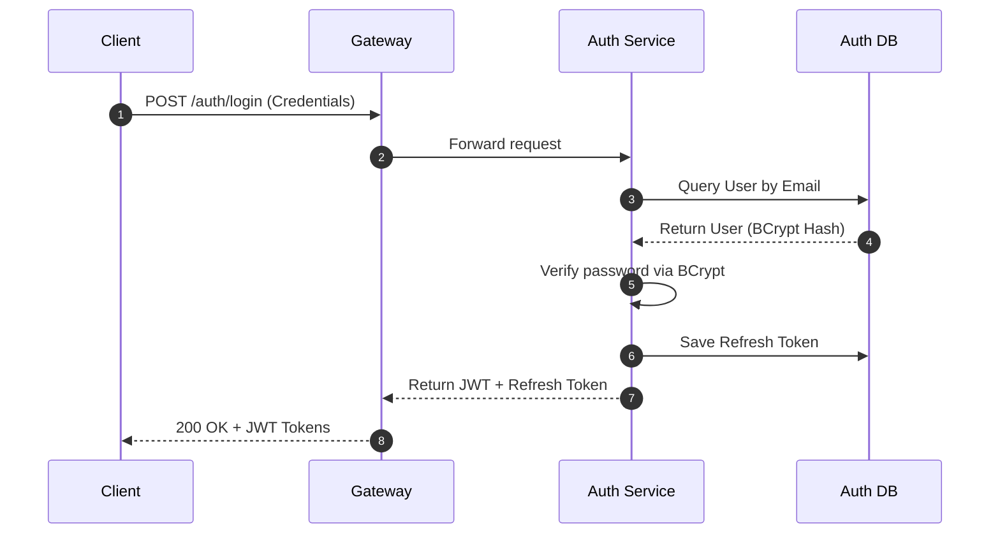

---

#### B. Profile Service
- **Purpose**: Aggregates details about candidates (career profiles) and recruiters (employer branding).
- **Responsibilities**:
  - Captures candidate professional attributes (resume links, education, work histories, skills).
  - Handles recruiter company properties (company name, description, address, contact numbers).
- **APIs Handled**: `/profiles/candidate/{id}`, `/profiles/candidate/me`, `/profiles/recruiter/{id}`, `/profiles/recruiter/me`.
- **Database Tables Used**: `candidate_profiles`, `candidate_skills`, `candidate_experience`, `candidate_education`, `recruiter_profiles`.
- **Inter-service Communication**: Listens to `user.registered` to bootstrap empty default profiles. Publishes `profile.viewed` events to RabbitMQ.
- **Technologies Used**: Spring Boot, Spring Data JPA, Spring Data Redis, Lombok, MySQL.
- **Security Implementation**: Restricts writes using extracted JWT gateway header identities (`X-User-Email`).
- **Internal Flow**:

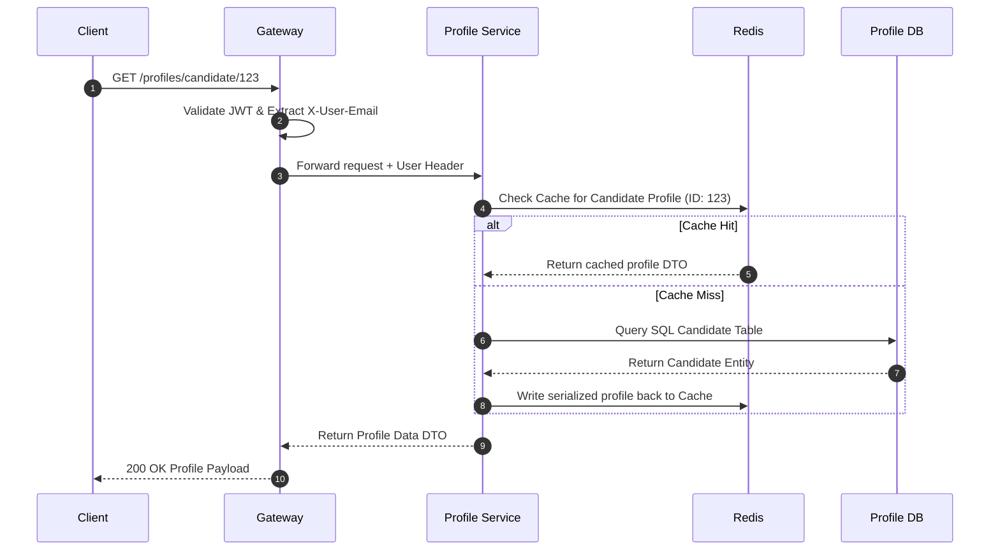

---

#### C. Job Service
- **Purpose**: Coordinates job listing operations and handles search lookups.
- **Responsibilities**:
  - Allows recruiters to draft, publish, and close job postings.
  - Verifies active subscription status using synchronous REST templates before allowing new posts.
- **APIs Handled**: `POST /jobs`, `GET /jobs`, `GET /jobs/{id}`, `PUT /jobs/{id}`, `DELETE /jobs/{id}`, `POST /jobs/search`.
- **Database Tables Used**: `jobs`.
- **Inter-service Communication**:
  - Performs synchronous REST call to `subscription-service` to check recruiter balance/limits.
  - Publishes `job.created` messages to RabbitMQ.
- **Technologies Used**: Spring Boot, Spring Data JPA, Spring Cloud OpenFeign, Lombok, MySQL.
- **Security Implementation**: Checks recruiter role validation at the API Gateway level. Passes `X-User-Email` to cross-reference posting ownership.

---

#### D. Application Service
- **Purpose**: Controls the lifecycle of job applications.
- **Responsibilities**:
  - Records application metadata (cover letters, resumes, applied timestamps).
  - Allows recruiters to update application states (Applied, Reviewing, Shortlisted, Hired, Rejected).
- **APIs Handled**: `POST /applications/apply`, `GET /applications/candidate/{id}`, `GET /applications/job/{jobId}`, `PUT /applications/status/{id}`.
- **Database Tables Used**: `applications`.
- **Inter-service Communication**:
  - Queries `job-service` via REST to ensure job postings are active.
  - Publishes `application.created` and `application.status.changed` events to RabbitMQ.
- **Technologies Used**: Spring Boot, Spring Data JPA, Lombok, MySQL.
- **Security Implementation**: Validates candidate identity during application submission, and confirms recruiter ownership of the target job before allowing status updates.

---

#### E. Interview Service
- **Purpose**: Manages schedules and coordination for recruitment interviews.
- **Responsibilities**:
  - Allows recruiters to set up interviews with candidates for active applications.
  - Holds links for virtual meeting platforms, physical locations, dates, and times.
- **APIs Handled**: `POST /interviews/schedule`, `GET /interviews/candidate/{id}`, `GET /interviews/recruiter/{id}`, `PUT /interviews/{id}/status`.
- **Database Tables Used**: `interviews`.
- **Inter-service Communication**: Publishes `interview.scheduled`, `interview.confirmed`, and `interview.cancelled` events to RabbitMQ.
- **Technologies Used**: Spring Boot, Spring Data JPA, Lombok, MySQL.
- **Security Implementation**: Restricts status changes to only the assigned recruiter or candidate.

---

#### F. Notification Service
- **Purpose**: Consumes events and dispatches user notifications asynchronously.
- **Responsibilities**:
  - Ingests RabbitMQ messages from multiple backend services.
  - Persists notifications to the database.
  - Dispatches HTML notifications to SMTP servers.
  - Delivers real-time notifications to the frontend over active WebSocket channels.
- **APIs Handled**: `GET /notifications/user/{userId}`, `PUT /notifications/{id}/read`.
- **Database Tables Used**: `notifications`.
- **Inter-service Communication**: Asynchronously consumes events from various queues bound to the central `notification.exchange`.
- **Technologies Used**: Spring Boot, Spring Data JPA, Spring Boot AMQP, Spring WebSocket STOMP, JavaMailSender, Lombok, MySQL.
- **Security Implementation**: Restricts notification queries to the currently authenticated user.
- **Internal Flow**:

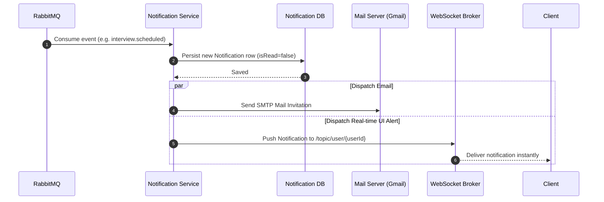

---

#### G. Subscription Service
- **Purpose**: Monetization engine managing plans, billing, and system limits.
- **Responsibilities**:
  - Manages subscription tiers (Free, Professional, Enterprise) for recruiters.
  - Generates invoices for successful payments.
  - Monitors quota usage, such as how many jobs a recruiter has posted vs their plan limit.
- **APIs Handled**: `POST /subscriptions/upgrade`, `GET /subscriptions/status/{recruiterId}`, `GET /invoices/{recruiterId}`.
- **Database Tables Used**: `subscriptions`, `invoices`.
- **Inter-service Communication**: Exposes endpoints for `job-service` to query job quota balances. Publishes `payment.success` events to RabbitMQ.
- **Technologies Used**: Spring Boot, Spring Data JPA, Lombok, MySQL.

---

#### H. Analytics Service
- **Purpose**: Telemetry aggregation and reporting.
- **Responsibilities**:
  - Compiles statistical charts for recruiters and system administrators.
  - Calculates job posting trends, application metrics, user growth, and active subscription revenues.
- **APIs Handled**: `GET /analytics/recruiter/{id}`, `GET /analytics/admin`, `GET /analytics/dashboard-stats`, `GET /analytics/charts/{chartType}`.
- **Database Tables Used**: Read-only cross-database joins on `hireconnect.users`, `hireconnect_jobs.jobs`, `hireconnect_applications.applications`, and `hireconnect_subscriptions.subscriptions`.
- **Inter-service Communication**: Reads raw data across multiple database schemas directly using Spring `JdbcTemplate`.
- **Technologies Used**: Spring Boot, Spring Data JDBC (`JdbcTemplate`), Lombok.
- **Security Implementation**: Restricts endpoints to users authenticated as administrators or recruiters.

---

## 4. Database Design & Schema Analysis

### 4.1 Relational Database Schema Model (ERD)

Below is the entity-relationship layout illustrating the tables managed by each microservice and their logical references (which are resolved at the application level in a microservice architecture):

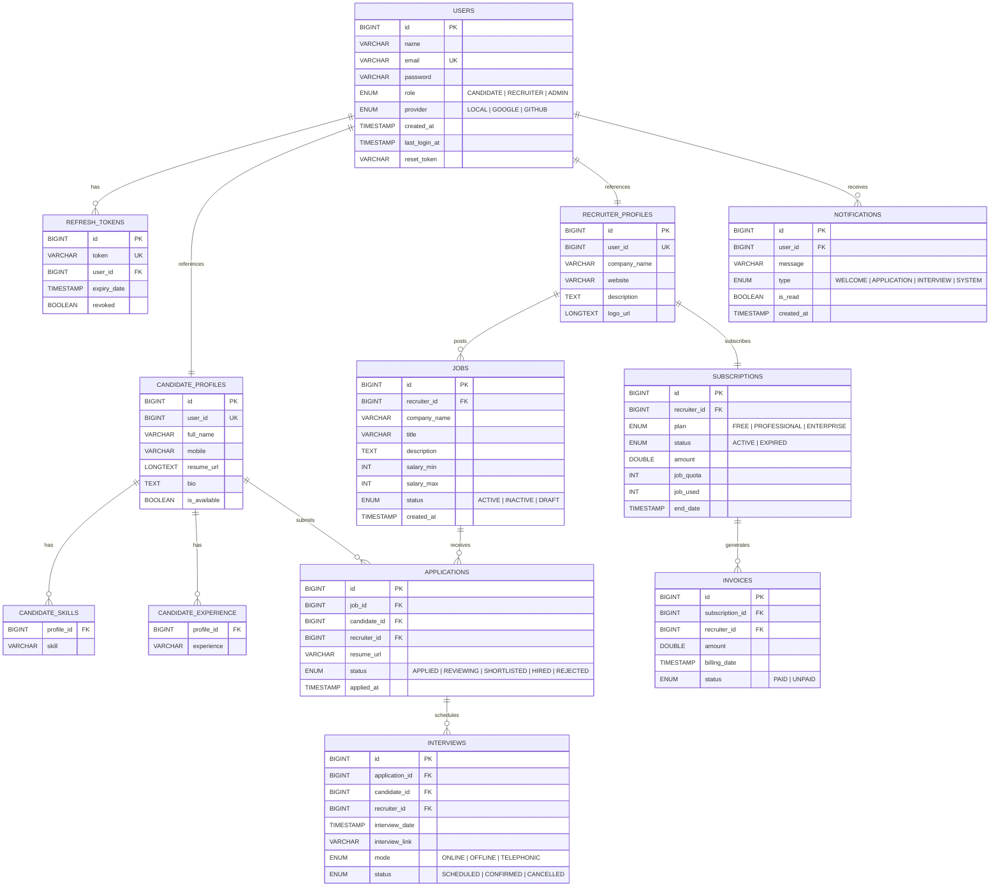

---

### 4.2 Database Design Rationale (Why MySQL?)
1. **Strong ACID Transaction Isolation**: Essential for billing operations in `subscription-service`, profile modifications in `profile-service`, and job application status changes in `application-service` to prevent double-writes and race conditions.
2. **Simplified Schema Governance**: Spring Boot JPA and Hibernate interact cleanly with MySQL Dialects to support automatic schema updates (`ddl-auto: update`) and migrations.
3. **Structured Query Performance**: Relational models allow structured indexing of frequently searched properties, such as user emails, job statuses, application queues, and recruiter quotas.

---

### 4.3 Schema Normalization Analysis
The relational design is normalized to **3rd Normal Form (3NF)** to avoid update, deletion, and insertion anomalies:
- **1st Normal Form (1NF)**: All table fields store atomic values, and there are no repeating groups. For multi-valued attributes like candidate skills, experience, and education, the database decouples them into distinct dependent child tables (`candidate_skills`, `candidate_experience`, `candidate_education`) rather than using comma-separated strings inside a single row.
- **2nd Normal Form (2NF)**: All tables are in 1NF, have single-attribute primary keys (`id`), and all non-key attributes are fully functionally dependent on the primary key, avoiding partial dependencies.
- **3rd Normal Form (3NF)**: All tables are in 2NF, and all non-key fields depend *only* on the primary key, avoiding transitive dependencies. For example, profile metadata (like company description) is kept inside `recruiter_profiles` instead of being duplicated in the `jobs` table, avoiding redundant updates when company details change.

---

### 4.4 High-Performance Indexing Strategy
To maintain sub-second response times as table rows grow, indexes are applied to the columns most frequently used in search queries, lookups, and joins:

```sql
-- Fast credential validations during login
CREATE UNIQUE INDEX idx_email ON users(email);

-- Fast lookup of active refresh tokens during token refreshes
CREATE INDEX idx_token ON refresh_tokens(token);

-- Fast user profile lookups
CREATE UNIQUE INDEX idx_user_id ON candidate_profiles(user_id);
CREATE UNIQUE INDEX idx_rec_user_id ON recruiter_profiles(user_id);

-- Rapid search and filtering of job boards
CREATE INDEX idx_job_status ON jobs(status);
CREATE INDEX idx_job_recruiter ON jobs(recruiter_id);

-- Candidate dashboards listing their applications
CREATE INDEX idx_app_candidate ON applications(candidate_id);
CREATE INDEX idx_app_job ON applications(job_id);

-- User notifications lists sorted by read status and timestamp
CREATE INDEX idx_notif_user_read ON notifications(user_id, is_read);
```

---

### 4.5 Database Transactions & Query Optimization
- **Spring Transaction Isolation**: Business methods are annotated with `@Transactional`. If any runtime exception occurs during critical updates, all database operations within the execution scope roll back automatically, ensuring data integrity.
- **N+1 Query Resolution**: Service queries use JPQL `JOIN FETCH` statements or Entity Graphs to pull relational parent-child entities in a single SQL operation, avoiding the performance degradation caused by executing multiple individual sub-queries.

---

## 5. Authentication & Security Implementation

### 5.1 Centrally Orchestrated JWT Security Model
HireConnect secures all API routes via stateless **JSON Web Token (JWT)** checks. Rather than having each microservice handle JWT verification independently, the API Gateway acts as a centralized authentication filter:

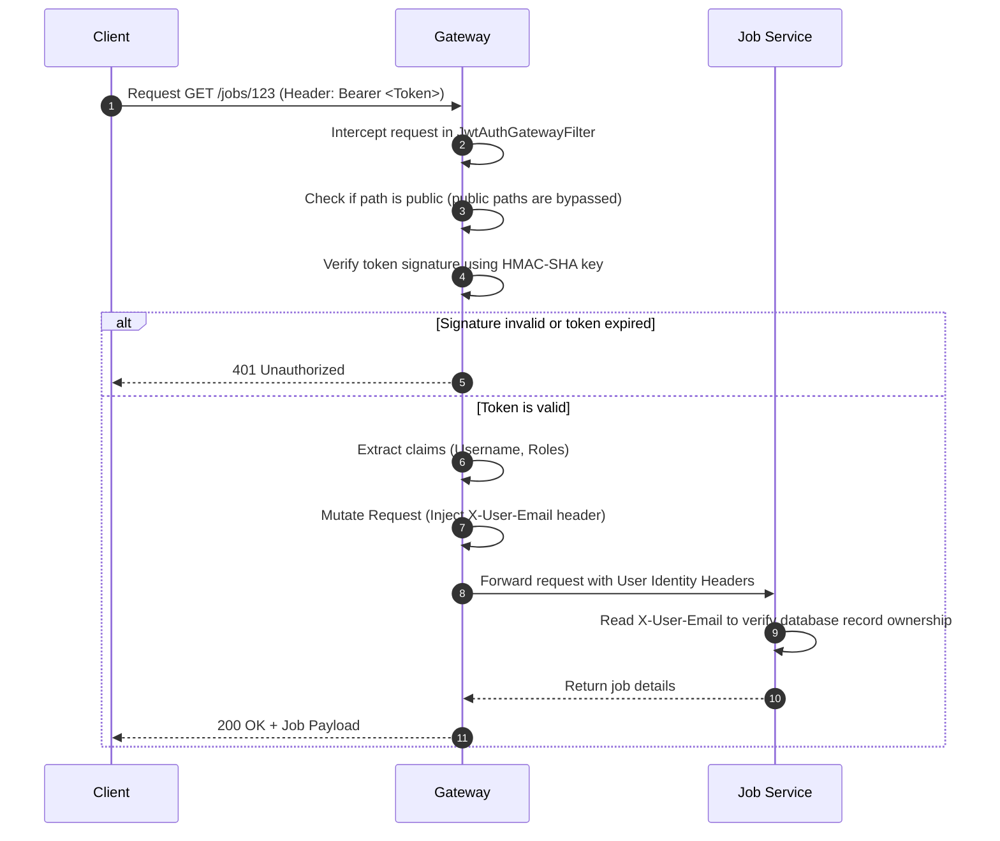

---

### 5.2 Key Security Framework Components
1. **Password Hashing**: Plaintext passwords are encrypted before database insertion using the **BCrypt hashing algorithm** with a secure work factor of 10 (`BCryptPasswordEncoder`).
2. **Gateway Request Ingestion**: The gateway's `JwtAuthGatewayFilter` checks incoming requests for a `Bearer` token inside the `Authorization` header. It validates the token's lifetime and cryptographic signature. If validation succeeds, it injects identity details into custom downstream headers:
   - `X-User-Email`: Extracted username/email.
   - `X-User-Name`: Authenticated user name.
3. **Internal Microservices Security**: Downstream services (e.g., `job-service`, `profile-service`) trust the headers injected by the API Gateway. They read `X-User-Email` directly to check resource ownership and perform authorization checks.
4. **CORS Configuration**: Centralized CORS rules on the API Gateway restrict resource sharing to approved origins (e.g., `http://localhost:4200` for Angular development), blocking malicious scripts from unauthorized domains.

---

## 6. Event-Driven Integration with RabbitMQ

### 6.1 Rationale for Asynchronous Message Brokerage
- **Decoupling**: Services can trigger downstream workflows without knowing which services consume the results. For example, the `application-service` publishes a message when an application is submitted, completely unaware of how the `notification-service` handles user notifications.
- **Resilience**: If the `notification-service` is temporarily down, messages are safely persisted in RabbitMQ queues and consumed once the service recovers, preventing notification loss.
- **Performance Optimization**: Operational API calls (like submitting a job application) return immediate success responses to the user, moving slow background operations (like formatting and sending emails) to background queues.

---

### 6.2 RabbitMQ Topology Configurations

The platform configures a **Topic Exchange** named `notification.exchange`. Messages are published with specific routing keys, and queues are bound to this exchange with matching routing patterns:

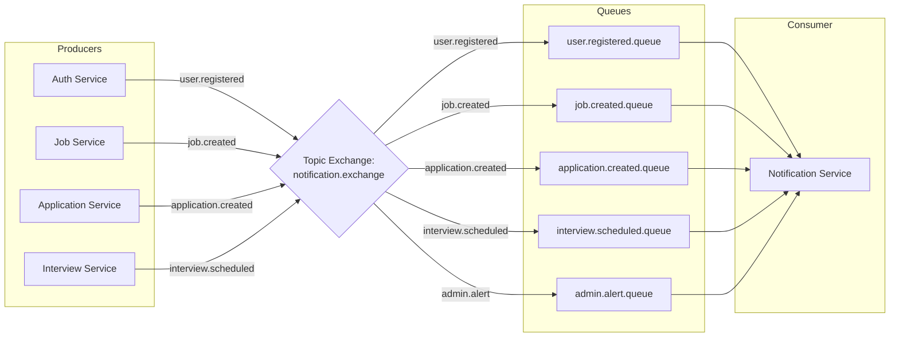

#### Detailed Queue-to-Routing Key Bindings:
- **Queue**: `user.registered.queue` $\rightarrow$ **Routing Key**: `user.registered`
- **Queue**: `user.password.reset.queue` $\rightarrow$ **Routing Key**: `user.password.reset`
- **Queue**: `job.created.queue` $\rightarrow$ **Routing Key**: `job.created`
- **Queue**: `application.created.queue` $\rightarrow$ **Routing Key**: `application.created`
- **Queue**: `application.status.changed.queue` $\rightarrow$ **Routing Key**: `application.status.changed`
- **Queue**: `interview.scheduled.queue` $\rightarrow$ **Routing Key**: `interview.scheduled`
- **Queue**: `interview.confirmed.queue` $\rightarrow$ **Routing Key**: `interview.confirmed`
- **Queue**: `interview.rescheduled.queue` $\rightarrow$ **Routing Key**: `interview.rescheduled`
- **Queue**: `interview.cancelled.queue` $\rightarrow$ **Routing Key**: `interview.cancelled`
- **Queue**: `profile.viewed.queue` $\rightarrow$ **Routing Key**: `profile.viewed`
- **Queue**: `admin.alert.queue` $\rightarrow$ **Routing Key**: `admin.alert`

---

### 6.3 Message Lifecycle Example: Scheduling an Interview
The diagram below shows how an interview event travels through the system:

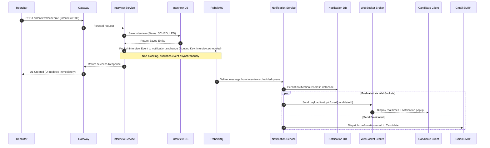

---

## 7. Frontend Architecture (Angular)

### 7.1 Modern Angular Framework Structure
The client application is built with **Angular**, using TypeScript, reactive styling via Tailwind CSS, component modularity, and RxJS-driven state management.

```
frontend/
├── src/
│   ├── main.ts                     # Application entry point
│   ├── index.html                  # Core HTML container
│   ├── styles.scss                 # Tailwind CSS & global styles
│   └── app/
│       ├── app.component.ts        # Root app component
│       ├── app.config.ts           # Application routing & dependency injection
│       ├── app.routes.ts           # Route definitions & guards
│       ├── core/                   # Singleton infrastructure services
│       │   ├── guards/             # Route activation guards (AuthGuard, RoleGuard)
│       │   ├── interceptors/       # HTTP Interceptors (JWT Injection, Error Handling)
│       │   └── services/           # Platform API client wrappers
│       ├── layout/                 # Layout wraps (Navbar, Footer, Sidebar)
│       ├── models/                 # TypeScript interfaces & domain models
│       ├── shared/                 # Reusable shared components (buttons, badges)
│       └── pages/                  # Page layout views
│           ├── public/             # Public landing pages, job searches
│           ├── auth/               # Login, registration, password resets
│           ├── candidate/          # Candidate profile pages, application trackers
│           ├── recruiter/          # Job management, candidate review, billing
│           └── admin/              # User moderation, master telemetry
```

---

### 7.2 Core Architectural Patterns
- **Protected Routing & Guards**: Routes are protected by Angular `CanActivateFn` guards. The `AuthGuard` checks for a valid session token, while `RoleGuard` restricts specific dashboards (like `/admin` or `/recruiter`) to users with matching claims.
- **Centralized HTTP Interceptors**: The application registers a functional HTTP Interceptor (`jwt.interceptor.ts`). It intercepts all outgoing HTTP requests, extracts the JWT token from `localStorage`, and appends an `Authorization: Bearer <Token>` header if the user is authenticated, eliminating the need to add headers to requests manually.
- **Reactive Forms & Input Validation**: User input is validated in real-time using Angular `ReactiveFormsModule`. Submit buttons remain disabled until inputs satisfy requirements (such as email formatting or password length).
- **RxJS State Management**: Components share application states reactively using `BehaviorSubject` streams. For example, authentication status is exposed via an `AuthService` observable, causing components like navbars to update dynamically when users log in or log out.

---

### 7.3 Component Hierarchy Diagram

```mermaid
graph TD
    AppComponent[AppComponent - Root Container]
    
    subgraph Shared Layouts
        Navbar[NavbarComponent]
        Footer[FooterComponent]
        Sidebar[SidebarComponent]
    end

    subgraph Pages Routing
        PublicPages[Public Pages]
        AuthPages[Authentication Pages]
        CandidatePages[Candidate Dashboard]
        RecruiterPages[Recruiter Dashboard]
        AdminPages[Admin Control Panel]
    end

    AppComponent --> Navbar
    AppComponent --> Footer
    AppComponent --> Sidebar
    
    AppComponent --> PublicPages
    AppComponent --> AuthPages
    AppComponent --> CandidatePages
    AppComponent --> RecruiterPages
    AppComponent --> AdminPages

    PublicPages --> JobSearch[JobSearchComponent]
    PublicPages --> JobDetail[JobDetailComponent]
    
    AuthPages --> Login[LoginComponent]
    AuthPages --> Register[RegisterComponent]
    
    CandidatePages --> CandidateProfileView[ProfileComponent]
    CandidatePages --> CandidateApps[AppTrackerComponent]
    
    RecruiterPages --> PostJob[PostJobComponent]
    RecruiterPages --> RecruiterApps[ReviewAppsComponent]
    RecruiterPages --> ScheduleInterview[ScheduleComponent]
    
    AdminPages --> AdminDashboard[AnalyticsComponent]
    AdminPages --> UserModerate[UserModerateComponent]
```

---

## 8. End-to-End User & Request Flows

### 8.1 User Registration Flow

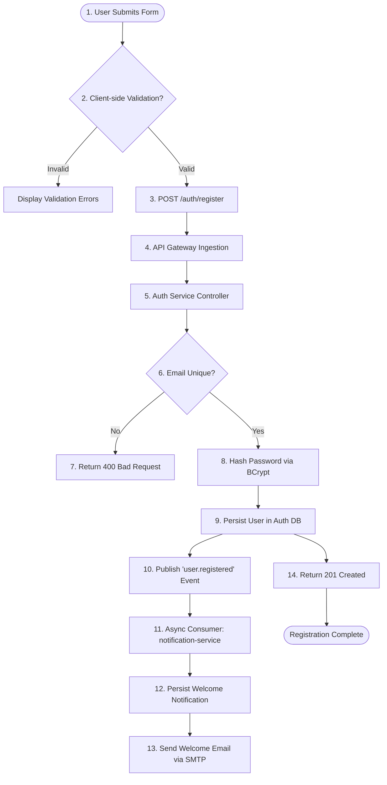

---

### 8.2 Recruiter Job Posting Flow

```mermaid
graph TD
    Start([1. Recruiter clicks 'Post Job']) --> CheckSub[2. Call /subscriptions/status/{recruiterId}]
    
    CheckSub --> SubOk{3. Active subscription & quota remaining?}
    SubOk -->|No| ShowUpgrade[4. Block Posting & prompt Upgrade Page]
    SubOk -->|Yes| InputDetails[5. Submit Job Requisition Form]
    
    InputDetails --> SendPost[6. POST /jobs]
    SendPost --> Gateway[7. Gateway JWT Validation]
    Gateway --> JobService[8. Job Service Requisition Ingest]
    
    JobService --> SaveJob[9. Save Job in jobs table Status: ACTIVE]
    SaveJob --> DecrQuota[10. Decrement Recruiter Subscription Quota]
    SaveJob --> PubJob[11. Publish 'job.created' Event]
    
    PubJob --> NotifS[12. Notification Service Ingests Event]
    NotifS --> PushWS[13. WebSocket alert: New Job alerts matches skills]
    
    SaveJob --> JobSuccess[14. Return 201 Created success payload]
```

---

### 8.3 Candidate Job Application Flow

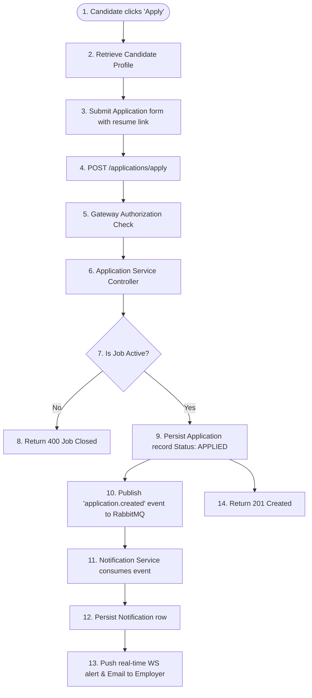

---

## 9. Deployment Architecture

### 9.1 Multi-Container Docker Orchestration
HireConnect is containerized using **Docker** and orchestrated locally with **Docker Compose**, ensuring consistency across development and production environments.

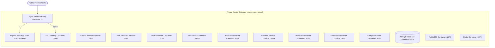

### 9.2 Key Deployment Configurations
- **Multi-Stage Dockerfile Builds**: Backend Java services use multi-stage Dockerfiles. In the builder stage, maven packages the application code. In the runner stage, a lightweight **OpenJDK 21 Alpine runtime** executes the packaged JAR, keeping target image sizes small and secure.
- **Nginx Reverse Proxy hosting**: The Angular frontend is compiled to static files (`dist`) and hosted inside an Nginx container. Nginx serves the static files and forwards client API requests starting with `/api` to the Spring Cloud Gateway container, avoiding browser cross-origin (CORS) blocks.
- **Service Dependency Sequencing**: The `docker-compose.yml` file uses container healthchecks to manage service startup orders. Application services wait to start until key infrastructure components (MySQL, RabbitMQ, and Redis) are fully initialized and accepting connections.

---

## 10. Design Patterns & Architectural Best Practices

The HireConnect codebase adheres to industry-standard software engineering patterns to ensure maintainability, readability, and clean separation of concerns:

- **MVC (Model-View-Controller) Pattern**: Decouples presentation logic from business models.
  - **Model**: JPA database entities (e.g., `User.java`, `Job.java`).
  - **View**: Angular client templates and JSON payloads.
  - **Controller**: `@RestController` classes handling HTTP requests and returning DTO responses.
- **Repository Pattern**: Extends `JpaRepository` to abstract database interactions. This decouples business logic from raw SQL operations, allowing the database layer to be easily mocked during unit testing.
- **Service Layer Separation**: Business rules are isolated inside `@Service` classes, separating transaction management and logic execution from HTTP controllers.
- **Data Transfer Objects (DTOs)**: Services communicate using DTOs instead of passing raw JPA entities directly. This prevents internal database models from leaking to client interfaces, reduces network payload sizes, and avoids Hibernate serialization errors.
- **Declarative Input Validation**: Inputs are validated at controller entry points using Jakarta validation annotations (such as `@NotBlank`, `@Email`, `@Min`). If validation fails, Spring intercepts the request and returns a standard bad request response before any business logic executes.
- **Global Exception Handling**: Exception handling is centralized using `@RestControllerAdvice` and `@ExceptionHandler` classes. Unhandled exceptions are caught and formatted into standard JSON error responses before being returned to the client, preventing internal stack traces from leaking to the frontend.

---

## 11. Performance Optimization & Scalability Strategy

To support high candidate traffic and volume, the platform implements several horizontal performance and scalability practices:

- **Decentralized Performance (Horizontal Scalability)**: Backend services run statelessly. Since they do not store user sessions in memory, multiple instances of any service can run concurrently. A load balancer can distribute incoming traffic across these instances as load increases.
- **Database Caching via Redis**: The `profile-service` caches frequently requested candidate and recruiter profiles in Redis. This reduces duplicate read queries to the MySQL database, significantly speeding up profile load times.
- **Asynchronous Load Leveling**: Heavy operations—like processing payments, sending emails, or triggering matching alerts—are offloaded to RabbitMQ queues. This keeps client APIs responsive, as background tasks execute asynchronously without blocking main application threads.
- **Read-Optimized Telemetry**: The `analytics-service` uses Spring `JdbcTemplate` to execute optimized, read-only SQL queries directly across the databases. This avoids the overhead of loading complex JPA objects, keeping analytic dashboard loads fast and light.
- **Future Improvements**:
  - **CQRS (Command Query Responsibility Segregation)**: Separating write operations from search operations would allow the read database to scale independently.
  - **Database Replication**: Setting up primary-replica replication would route writes to a primary database while distributing read queries across multiple read replicas.

---

## 12. Complete Technical Summary

### 12.1 End-to-End Request Lifecycle Example
Below is the execution flow of a candidate applying for a job, illustrating how different system components interact in real-time:

```
[Candidate Browser UI]
       │ (1) Clicks "Apply" using JWT Token
       ▼
[Nginx Web Server Proxy] 
       │ (2) Proxies request to API Gateway
       ▼
[API Gateway :8080] 
       │ (3) Intercepts, validates JWT, mutates request headers
       ▼
[Application Service :8084] 
       │ (4) Receives request, performs business validation
       │ (5) Saves application status in Database (Status: APPLIED)
       │ (6) Publishes "application.created" message to RabbitMQ Broker
       │ (7) Returns HTTP 201 Success Response to Gateway
       ▼
[Candidate Browser UI] (Updates instantly with success feedback)

       ... Meanwhile, Asynchronously ...

[RabbitMQ Message Broker]
       │ (8) Routes "application.created" event to Notification Queue
       ▼
[Notification Service :8086]
       │ (9) Consumes the event from queue
       │ (10) Persists notification in database
       ├─(11a) Sends styled email confirmation via Gmail SMTP to Candidate
       └─(11b) Pushes WebSocket alert via STOMP to Recruiter's live browser dashboard
```

---

### 12.2 Architectural Highlights & Advantages
- **Decoupled Architecture**: Development teams can work on, test, and deploy services independently, speeding up delivery cycles and reducing deployment risks.
- **Targeted Scalability**: Resource-intensive services—like the `job-service` during peak search periods—can be scaled up individually without having to duplicate the entire platform infrastructure.
- **Resilient Fault Isolation**: If a non-core service crashes (e.g., `interview-service`), the rest of the application (including login, job searching, and profile editing) remains fully operational.
- **High-Performance Caching**: Redis caching reduces database load, keeping profile load times fast even during periods of high user traffic.

### 12.3 Summary of Solved Architectural Challenges
- **Eliminated Inter-Service Bottlenecks**: Decoupling workflows with RabbitMQ prevents services from blocking each other, keeping APIs responsive during high-volume events.
- **Simplified Security Management**: Local JWT validation at the API Gateway removes the need for downstream services to verify tokens, simplifying service logic and reducing authentication latency.
- **Optimized Analytical Queries**: Moving analytical queries to the dedicated `analytics-service` prevents complex aggregate queries from slowing down transactional services.

---

**This technical documentation provides a comprehensive overview of the HireConnect platform's architecture, database models, security practices, and event-driven patterns. It is structured for developers, architects, and stakeholders to understand, maintain, and scale the system.**
